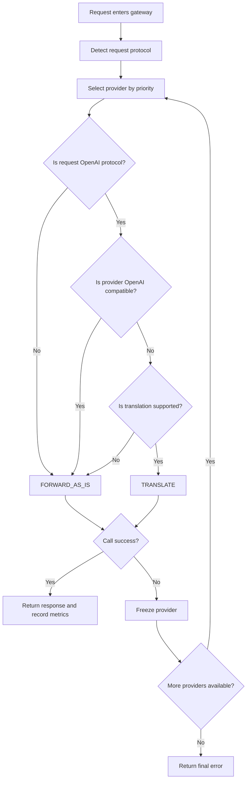

# LLM Gateway 需求文档

## 一、系统目标与定位

本系统是一个 **LLM Gateway（大模型网关）**，用于在多个 LLM Provider 之间提供统一接入、最小必要的协议转换、路由调度、可观测与管理能力。

### 核心定位

- 网关是一个 **最小干预的请求转发中介**
- 而不是严格的协议校验器或执行守门人
- 网关的唯一智能行为是：

> **仅在 OpenAI 请求无法被目标 Provider 原生执行时，进行必要的协议转换；
> 其余情况一律原样转发，成功与否由 Provider 决定。**

---

## 二、核心能力需求（功能性）

### 2.1 多协议兼容与转换

#### 支持的请求协议

支持所有请求协议，例如：
- OpenAI-compatible
- Anthropic 原生协议
- Gemini 原生协议

#### 协议转换能力

##### 支持范围

- 必须支持：
  - 文本生成
  - 图像识别（多模态输入）
  - 图片生成
  - Embedding
- 视频生成：尽可能支持（若 Provider 能力允许）

##### 转换触发条件（唯一条件）

协议转换 **只在以下条件同时满足时发生**：

1. 请求协议为 **OpenAI-compatible**
2. 目标 Provider **不支持 OpenAI-compatible 协议**
3. 系统已启用并支持该类转换

除上述情况外，**禁止协议转换**。

##### 转换原则

- 协议转换是 **最小必要行为**
- 不以“提高成功率”为目标
- 不对非 OpenAI 请求进行任何形式的协议转换
- 所有转换行为必须：
  - 可记录
  - 可追溯
  - 可在日志中明确标识

---

### 2.2 原样转发（FORWARD_AS_IS）

#### 定义

原样转发指：

- 请求头、请求体、响应头、响应体 **不做结构性修改**
- 网关仅负责：
  - 注入或替换 Provider API Key
  - 必要的认证 Header

#### 原样转发的适用范围

在以下所有场景中，网关 **必须选择原样转发**：

- 非 OpenAI 协议请求（Anthropic / Gemini 等）
- OpenAI 协议请求，且 Provider 支持 OpenAI-compatible
- OpenAI 协议请求，Provider 不支持 OpenAI-compatible，且未启用转换
- 任意请求命中“强制不转换”的运行模式

网关 **不因协议不匹配而阻断请求**，
Provider 是否能成功处理，由 Provider 自行决定。

---

### 2.3 Provider 路由与故障切换

#### Provider 优先级

- 每个 Provider 具有一个数值型优先级
- **优先级越大，越优先被选中**
- Provider 选择顺序：
  - 按优先级倒序遍历
  - 跳过被禁用或冻结的 Provider

#### 自动故障切换

当 Provider 调用出现以下情况之一：

- 请求失败（4xx / 5xx）
- 超时
- 网络异常

网关应：

1. 将该 Provider 标记为“失败”
2. 冻结该 Provider
3. 自动尝试下一个候选 Provider

#### Provider 冻结机制

- 冻结状态下的 Provider：
  - 不参与路由选择
- 冻结时间：
  - 遵从系统全局冻结时间配置
  - 到期后自动解冻并重新参与调度

---

### 2.4 流程图

---

## 三、请求处理逻辑（权威行为模型）

### 核心处理流程

1. 识别请求协议
2. 按优先级选择可用 Provider
3. 判断是否满足协议转换触发条件
4. 执行协议转换或原样转发
5. 调用失败时冻结 Provider 并尝试下一个

### 行为规则说明

- **非 OpenAI 请求**
  - 一律原样转发
- **OpenAI 请求**
  - Provider 支持 OpenAI-compatible → 原样转发
  - Provider 不支持 OpenAI-compatible：
    - 启用转换 → 转换后转发
    - 未启用转换 → 原样转发（由 Provider 返回错误）

网关 **不对 Provider 能否成功做前置判断**。

---

## 五、Web 管理页面需求

### 5.1 Provider 管理

- Provider 列表默认按 **优先级倒序**展示
- 支持：
  - 启用 / 禁用 Provider
  - 调整 Provider 优先级
  - 查看冻结状态与剩余冻结时间
- 支持一键获取 Provider 可用模型列表
- Provider 下支持：
  - 勾选启用模型
  - 手动输入模型 ID（私有 / 自定义模型）
  - 为模型设置别名（客户端通过别名请求）

---

### 5.2 模型测试

- 对每个 Provider / Model 支持测试调用
- 测试指标包括：
  - TPS
  - 首 Token 延迟（First Token Latency）

---

### 5.3 日志与请求详情

#### 日志字段

- 请求模型（别名 + 原始 ID）
- URL Endpoint
- Request Body
- Response Body
- 是否 Streaming
- 实际使用的 Provider
- 请求状态（success / error）
- 总延迟（Latency）
- 首 Token 延迟
- Token 使用量：
  - input
  - output
  - total
  - cache（如有）
- 请求时间

#### 特性

- 支持筛选、分页
- Streaming 请求可仅展示最终聚合结果

---

### 5.4 数据统计与留存

- 基础统计能力：
  - 请求量
  - 成功率
  - 平均延迟
  - Token 使用量
- 支持配置：
  - 日志与指标数据保存时间
  - 自动清理过期数据
  - Provider 冻结时间

---

## 六、非功能性要求

- 所有请求行为必须 **可解释、可回溯**
- 不因新增 Provider 或协议破坏现有决策模型
- 系统应适合：
  - 个人部署
  - 单实例运行
  - 低运维成本

---

## 七、最终设计基石

> **这是一个“最小干预”的 LLM Gateway：
> 只在 OpenAI 请求无法直接执行时做必要转换，
> 其余情况一律原样转发，
> 不替 Provider 判断成败。**